# Abensi Unas
## Project Tugas Akhir
Indonesia: Kombinasi Algoritma Haverine Formula dan Algoritma Sequential Search pada absensi online berbasis Web
Inggris: A Combination of the Haversine Formula Algorithm and the Sequential Searching Algorithm in Web based Online Attendance
https://ieeexplore.ieee.org/document/10127681
------
### Halaman Login

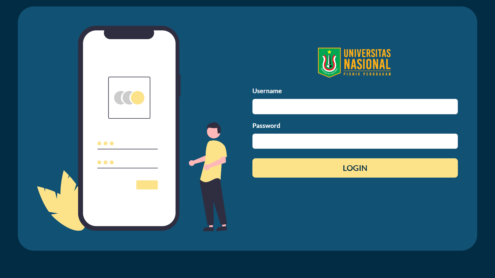
------
## Mahasiswa
### Halaman Home

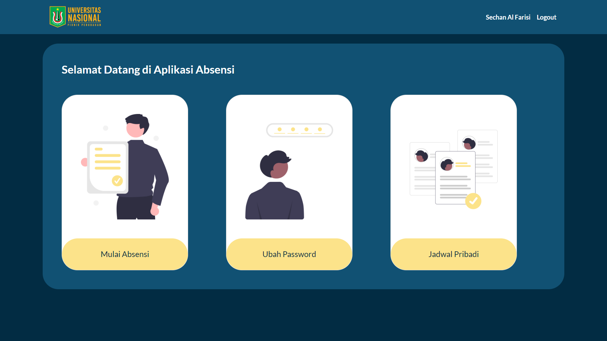

### Jadwal Pribadi

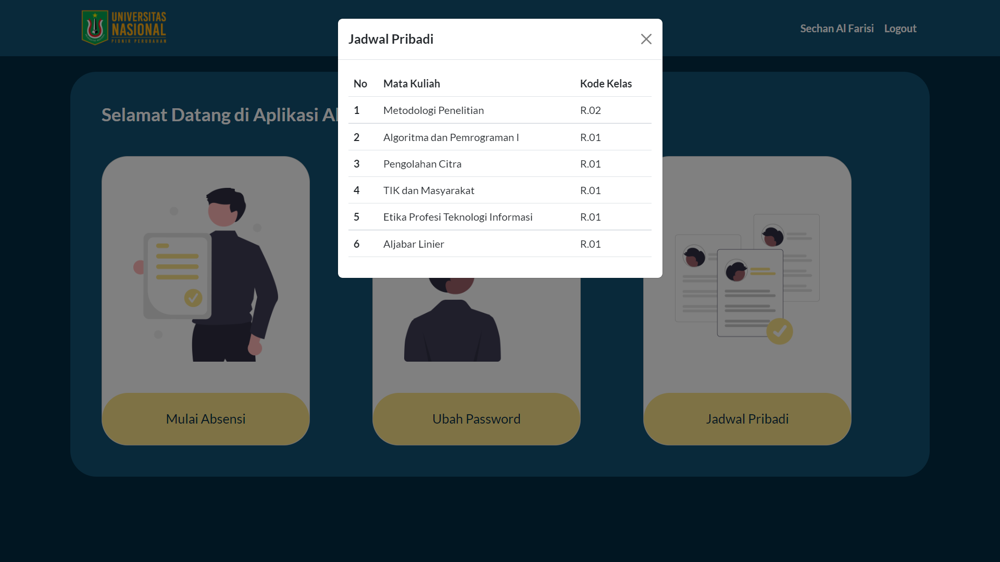

### Ubah Password

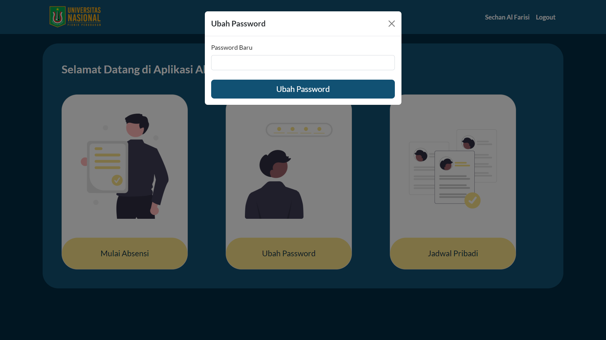

### Halaman Cek Lokasi

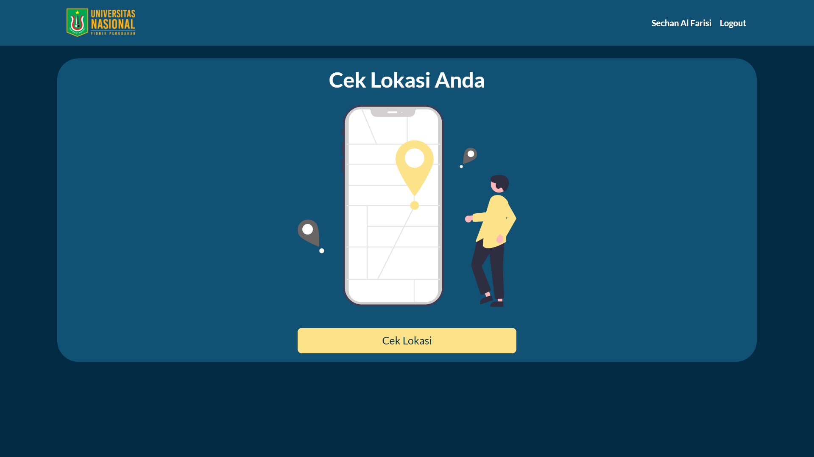

### Halaman Gagak Cek Lokasi

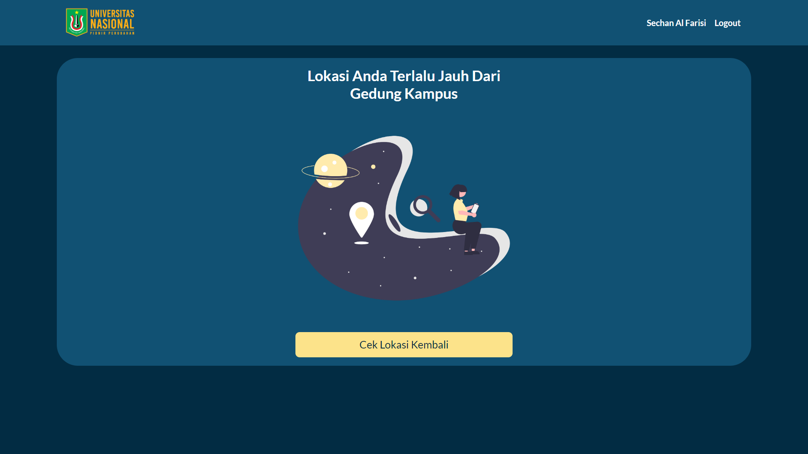

### Halaman Pilih Mata Kuliah

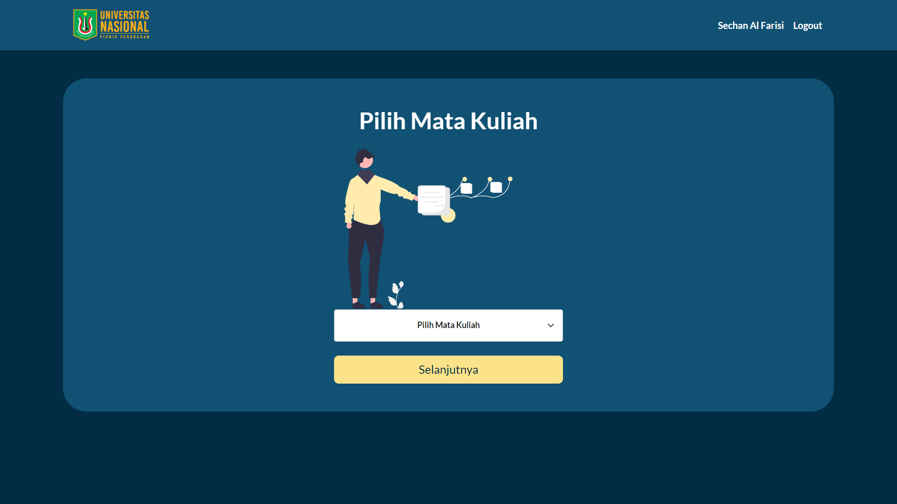

### Halaman Pilih Kelas

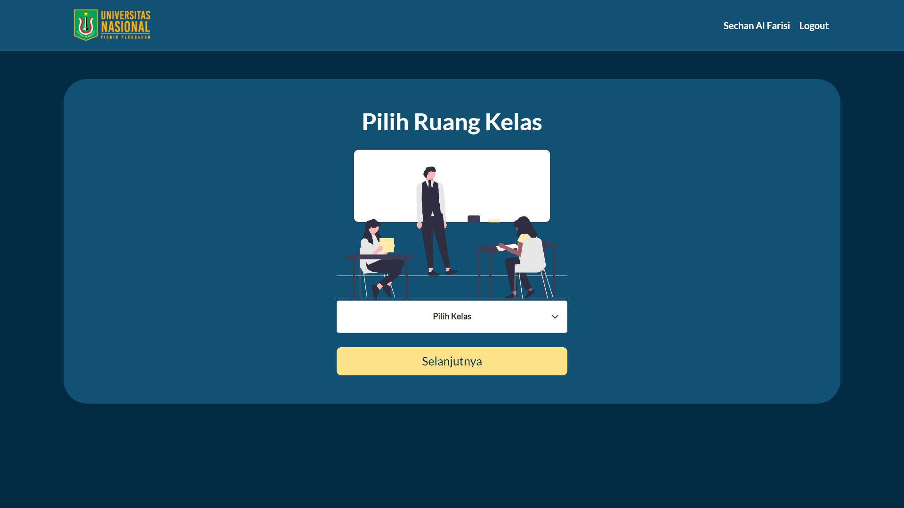

### Halaman Foto Absensi

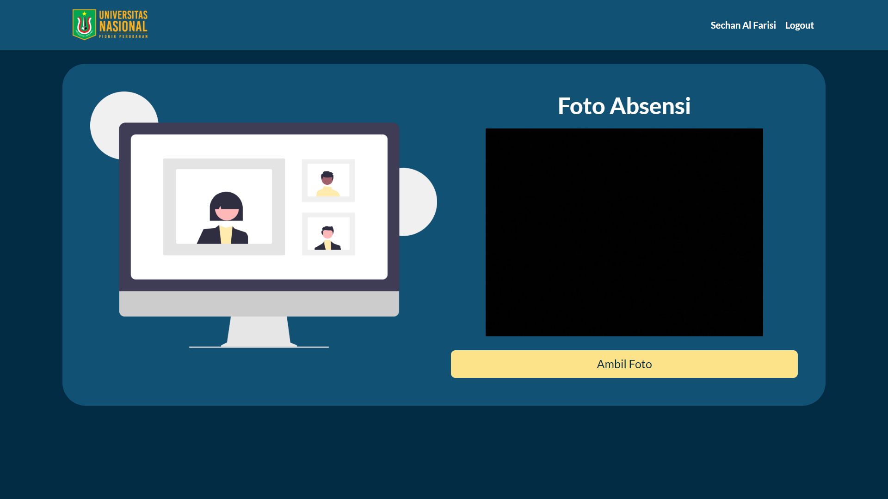

### Halaman Abensi Berhasi

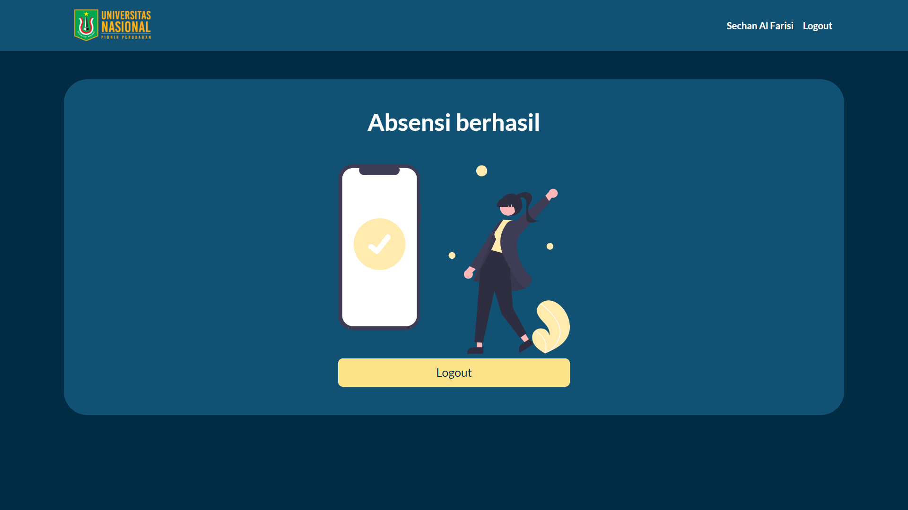

------
## Dosen
### Halaman Dosen

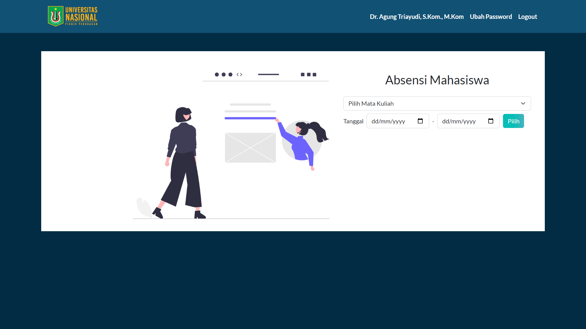

### Halaman Abensi Mata Kuliah

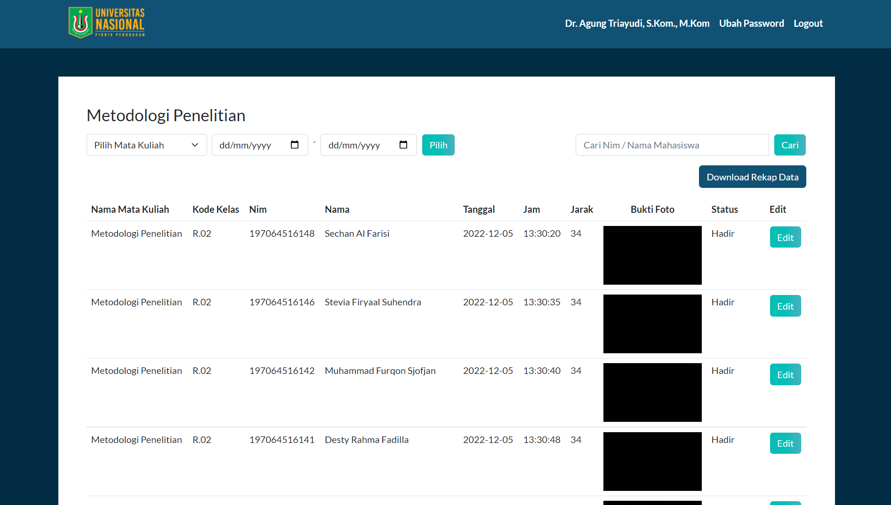

### Halaman Edit Kehadiran

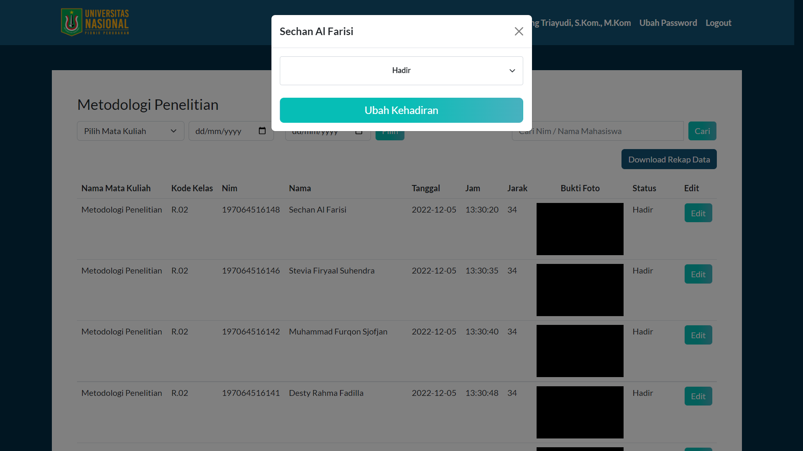

